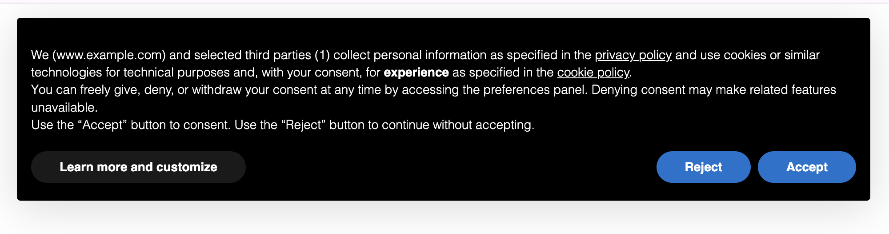

# astro-iubenda

This Astro integration fetches and provides Iubenda Privacy Policy, Cookie Policy, and Terms & Conditions content for your Astro project.

## Why astro-iubenda?

[Iubenda](https://www.iubenda.com/) is a popular service that helps websites comply with legal requirements for privacy policies and terms of service. This integration simplifies the process of fetching and displaying Iubenda legal documents in your Astro project.



### Features

- **🔄 Automatic document fetching** - Automatically fetches your Iubenda Privacy Policy, Cookie Policy, and Terms & Conditions at build time.
- **🎯 Multiple access methods** - Access documents via a virtual module or as JSON files written to disk.
- **🔧 Flexible configuration** - Strip HTML markup for easier styling, configure output directories, and more.
- **🍪 Cookie Solution Integration** - Built-in support for Iubenda Cookie Solution banner with Google Tag Manager integration.
- **🧩 TypeScript native** - Full TypeScript support with proper typings for improved developer experience.
- **⚡ Zero dependencies** - Lightweight integration with no external dependencies, keeping your project slim.
- **📦 Tiny footprint** - Only 2.53 kB (minified and gzipped). [Size Limit](https://github.com/ai/size-limit) controls the size.
- **🔥 HMR support** - Changes to configuration are reflected immediately with Hot Module Replacement.
- **🌐 Multilingual support** - Handle documents in multiple languages with ease.
- **⚙️ Framework agnostic** - Works with any UI framework or vanilla HTML within your Astro project.
- **🔄 Compatible with all Astro rendering modes** - Works with SSG, SSR and hybrid rendering.

## Usage

### Installation

```bash
# Using npm
npm install astro-iubenda

# Using yarn
yarn add astro-iubenda

# Using pnpm
pnpm add astro-iubenda
```

### Finding Your Document IDs

To get your document IDs:

1. Log in to your [Iubenda dashboard](https://www.iubenda.com/en/dashboard)
2. Select your project
3. Find the document ID in the URL when viewing your policy:
   ```
   https://www.iubenda.com/privacy-policy/12345678
   ```
   Where `12345678` is your document ID

You can also find this ID in the embedded code section as described in the [Direct Text Embedding API documentation](https://www.iubenda.com/en/help/78-privacy-policy-direct-text-embedding-api).

If you have policies in multiple languages or for different purposes, you can use multiple document IDs in the configuration.

### Adding the Integration

Add the integration to your `astro.config.mjs` file:

```js
import { defineConfig } from "astro/config";
import iubenda from "astro-iubenda";

export default defineConfig({
  // ...
  integrations: [
    iubenda({
      documentIds: [<your-document-id>],
    }),
  ],
});
```

Then import the documents in your Astro components:

```astro
---
import { getDocument } from 'virtual:astro-iubenda';

const privacyPolicy = getDocument(<your-document-id>, 'privacyPolicy');
const cookiePolicy = getDocument(<your-document-id>, 'cookiePolicy');
const termsAndConditions = getDocument(<your-document-id>, 'termsAndConditions');
---

<div set:html={privacyPolicy}></div>
```

## Configuration

To configure this integration, pass an options object to the `iubenda()` function in your `astro.config.mjs` file.

```js
iubenda({
  documentIds: [<your-document-id>],
  saveInJson: true,
  outputDir: "src/content/iubenda",
  stripMarkup: true,
  cookieFooter: {
    iubendaOptions: {
      // Your Iubenda Cookie Solution configuration
    }
  }
});
```

| Parameter      | Type                           | Required | Default                 | Description                                                                                      |
| -------------- | ------------------------------ | -------- | ----------------------- | ------------------------------------------------------------------------------------------------ |
| `documentIds`  | `Array<string \| number>`      | Yes      | -                       | Array of Iubenda document IDs to fetch. You can find your document ID in your Iubenda dashboard. |
| `saveInJson`   | `boolean`                      | No       | `false`                 | Whether to write the fetched documents to disk as JSON files.                                    |
| `outputDir`    | `string`                       | No       | `'src/content/iubenda'` | Directory where JSON files will be written if `saveInJson` is true.                              |
| `stripMarkup`  | `boolean`                      | No       | `true`                  | Whether to strip HTML markup from the fetched documents.                                         |
| `cookieFooter` | `false \| CookieFooterOptions` | No       | `false`                 | Configuration for Iubenda Cookie Solution banner. See TypeScript types for full options.         |

### Cookie Solution Configuration

The integration supports Iubenda's Cookie Solution banner through the `cookieFooter` option. When enabled, it automatically injects the necessary scripts into your pages.

```js
iubenda({
	documentIds: ["12345678"],
	cookieFooter: {
		// Required: The configuration object from your Iubenda dashboard
		iubendaOptions: {
			siteId: 12345678,
			cookiePolicyId: 87654321,
			lang: "en",
			// Add any other Iubenda configuration options
		},
		// Optional: Google Tag Manager integration
		googleTagManagerOptions: true, // or customize with an object
		// Optional: Where to inject the banner scripts
		injectionStage: "head-inline", // or "page"
		// Optional: Banner version to use
		bannerVersion: "current", // "current", "beta", or "stable"
	},
});
```

#### Cookie Solution Options

| Option                    | Type                                                        | Required | Default         | Description                                                                                              |
| ------------------------- | ----------------------------------------------------------- | -------- | --------------- | -------------------------------------------------------------------------------------------------------- |
| `iubendaOptions`          | `IubendaOptions`                                            | Yes      | -               | The `_iub.csConfiguration` object you copy from the Iubenda dashboard.                                   |
| `googleTagManagerOptions` | `boolean \| { eventName?: string; dataLayerName?: string }` | No       | `false`         | Enable Google Tag Manager integration. Set to `true` to use defaults, or provide an object to customize. |
| `injectionStage`          | `"head-inline" \| "page"`                                   | No       | `"head-inline"` | Where to inject the banner scripts. `"head-inline"` is recommended by Iubenda.                           |
| `bannerVersion`           | `"current" \| "beta" \| "stable"`                           | No       | `"current"`     | The version of the Iubenda banner to use.                                                                |

#### Google Tag Manager Integration

When `googleTagManagerOptions` is enabled:

- By default, it pushes an event named `iubenda_consent_given` to the `dataLayer` as explained by the official [Iubenda guide](https://www.iubenda.com/en/help/1235-google-tag-manager-blocking-cookies)
- You can customize the event name and dataLayer name:

```js
cookieFooter: {
  iubendaOptions: { /* ... */ },
  googleTagManagerOptions: {
    eventName: "cookie_consent_given",
    dataLayerName: "customDataLayer"
  }
}
```

## API

The integration provides a virtual module that you can import in your components.

### Type Definitions

The integration exports comprehensive TypeScript types for better development experience:

```ts
// Import types for configuration
import type {
	CookieFooterOptions,
	IubendaOptions,
	IubendaCallbacks,
	HexColor,
	BannerVersion,
	TcfPurposesKeys,
	ConsentEventName,
} from "astro-iubenda";
```

**Available Types:**

- `CookieFooterOptions` - Main configuration interface for cookie footer
- `IubendaOptions` - Complete Iubenda configuration object
- `IubendaCallbacks` - All available callback functions
- `HexColor` - Type-safe hex color string (`#${string}`)
- `BannerVersion` - Banner version options (`"current"`, `"beta"`, `"stable"`)
- `TcfPurposesKeys` - TCF purpose IDs (`"1"` through `"10"`)
- `ConsentEventName` - Consent event types for callbacks

### documents

Full object with all fetched documents, keyed by document ID.

```js
import { documents } from "virtual:astro-iubenda";

// Access all policies for a specific document ID
const allPolicies = documents["12345678"];

// Access a specific policy directly
const privacyPolicy = documents["12345678"].privacyPolicy;
```

### getDocument(id, type)

**Parameters:**

- `id` - Document ID to retrieve
- `type` - Type of document ('privacyPolicy', 'cookiePolicy', or 'termsAndConditions')

**Returns:** The document content as a string, or null if not found.

```js
import { getDocument } from "virtual:astro-iubenda";

const privacyPolicy = getDocument("12345678", "privacyPolicy");
```

## Examples

### Basic Usage

```astro
---
import { getDocument } from 'virtual:astro-iubenda';
---

<html>
  <head>
    <title>Privacy Policy</title>
  </head>
  <body>
    <h1>Our Privacy Policy</h1>
    <div set:html={getDocument('12345678', 'privacyPolicy')}></div>
  </body>
</html>
```

### Using the documents object directly

```astro
---
import { documents } from 'virtual:astro-iubenda';

// Access all documents and their types for a specific ID
const docId = '12345678';
const allDocsForId = documents[docId];

// Access specific documents directly
const privacyPolicy = documents[docId].privacyPolicy;
const cookiePolicy = documents[docId].cookiePolicy;
const terms = documents[docId].termsAndConditions;
---

<h2>Available Documents</h2>
<ul>
  {privacyPolicy && <li><a href="/privacy">Privacy Policy</a></li>}
  {cookiePolicy && <li><a href="/cookies">Cookie Policy</a></li>}
  {terms && <li><a href="/terms">Terms and Conditions</a></li>}
</ul>

<!-- Using the full document object -->
<div class="policies">
  {Object.entries(allDocsForId).map(([type, content]) => (
    <div class="policy-preview">
      <h3>{type}</h3>
      <div class="preview" set:html={content.substring(0, 200) + '...'} />
    </div>
  ))}
</div>
```

### Multiple Documents

```js
// astro.config.mjs
import { defineConfig } from "astro/config";
import iubenda from "astro-iubenda";

export default defineConfig({
	integrations: [
		iubenda({
			documentIds: ["12345678", "87654321"],
			saveInJson: true,
		}),
	],
});
```

```astro
---
import { documents } from 'virtual:astro-iubenda';
---

<select id="policy-selector">
  <option value="12345678">English</option>
  <option value="87654321">Spanish</option>
</select>

<div id="policy-content"></div>

<script>
  const selector = document.getElementById('policy-selector');
  const content = document.getElementById('policy-content');
  const documents = {JSON.stringify(documents)};

  selector.addEventListener('change', () => {
    const id = selector.value;
    content.innerHTML = documents[id].privacyPolicy;
  });

  // Set initial content
  content.innerHTML = documents[selector.value].privacyPolicy;
</script>
```

### Cookie Solution with Callbacks

```ts
import type { IubendaCallbacks, ConsentEventName } from "astro-iubenda";

const callbacks: IubendaCallbacks = {
	onReady: (hasConsent: boolean) => {
		console.log("Iubenda ready, has consent:", hasConsent);
	},
	onBannerShown: () => {
		console.log("Banner shown");
	},
	onBannerClosed: () => {
		console.log("Banner closed");
	},
	onConsentGiven: (consent: boolean) => {
		console.log("Consent given:", consent);
		// Enable analytics, tracking, etc.
	},
	onConsentFirstGiven: (event: ConsentEventName) => {
		console.log("First consent given via:", event);
		// Track conversion event
	},
	onConsentRejected: () => {
		console.log("Consent rejected");
		// Disable tracking
	},
	onPreferenceExpressed: (preferences: unknown) => {
		console.log("User preferences:", preferences);
	},
	onPreferenceNotNeeded: () => {
		console.log("No preference needed for this user");
	},
	onCcpaOptOut: () => {
		console.log("User opted out (CCPA)");
	},
	onError: (message: string) => {
		console.error("Iubenda error:", message);
	},
};

// Use in your config
export default defineConfig({
	integrations: [
		iubenda({
			documentIds: ["12345678"],
			cookieFooter: {
				iubendaOptions: {
					siteId: 12345678,
					cookiePolicyId: 87654321,
					lang: "en",
					callback: callbacks,
				},
			},
		}),
	],
});
```

### Custom Colors and Theming

```ts
import type { HexColor } from "astro-iubenda";

// Type-safe hex color definitions
const brandColors = {
	primary: "#0073aa" as HexColor,
	secondary: "#005177" as HexColor,
	accent: "#00a0d2" as HexColor,
	dark: "#1e1e1e" as HexColor,
	light: "#f7f7f7" as HexColor,
} as const;

export default defineConfig({
	integrations: [
		iubenda({
			documentIds: ["12345678"],
			cookieFooter: {
				iubendaOptions: {
					siteId: 12345678,
					cookiePolicyId: 87654321,
					lang: "en",
					banner: {
						backgroundColor: brandColors.dark,
						textColor: brandColors.light,
						acceptButtonColor: brandColors.primary,
						acceptButtonCaptionColor: brandColors.light,
						customizeButtonColor: brandColors.secondary,
						customizeButtonCaptionColor: brandColors.light,
						rejectButtonColor: brandColors.accent,
						rejectButtonCaptionColor: brandColors.light,
						brandTextColor: brandColors.primary,
						brandBackgroundColor: brandColors.light,
					},
					floatingPreferencesButtonColor: brandColors.primary,
					floatingPreferencesButtonCaptionColor: brandColors.light,
				},
			},
		}),
	],
});
```

### Multi-language Setup with Different Configurations

```ts
// Define configurations for different languages/regions
const configs = {
	en: {
		siteId: 12345678,
		cookiePolicyId: 87654321,
		lang: "en",
		enableGdpr: true,
		enableCcpa: true,
	},
	es: {
		siteId: 12345678,
		cookiePolicyId: 11111111,
		lang: "es",
		enableGdpr: true,
		enableLgpd: true,
	},
	de: {
		siteId: 12345678,
		cookiePolicyId: 22222222,
		lang: "de",
		enableGdpr: true,
		gdprAppliesGlobally: true,
	},
} as const;

export default defineConfig({
	integrations: [
		iubenda({
			documentIds: ["87654321", "11111111", "22222222"],
			cookieFooter: {
				// Use the English config as default
				iubendaOptions: configs.en,
				googleTagManagerOptions: true,
			},
		}),
	],
});
```

### Advanced Cookie Solution Examples

**GDPR Configuration:**

```js
cookieFooter: {
  iubendaOptions: {
    siteId: 12345678,
    cookiePolicyId: 87654321,
    lang: "en",
    enableGdpr: true,
    gdprAppliesGlobally: false,
    perPurposeConsent: true,
    purposes: "1,2,3,4,5",
  }
}
```

**Custom Banner Styling:**

```js
cookieFooter: {
  iubendaOptions: {
    siteId: 12345678,
    cookiePolicyId: 87654321,
    lang: "en",
    banner: {
      position: "float-bottom-right",
      acceptButtonDisplay: true,
      customizeButtonDisplay: true,
      rejectButtonDisplay: true,
      backgroundColor: "#000000",
      textColor: "#ffffff",
      acceptButtonColor: "#0073aa",
      acceptButtonCaptionColor: "#ffffff",
      customizeButtonColor: "#dadada",
      customizeButtonCaptionColor: "#000000",
      rejectButtonColor: "#0073aa",
      rejectButtonCaptionColor: "#ffffff",
    }
  }
}
```

**CCPA (California) Configuration:**

```js
cookieFooter: {
  iubendaOptions: {
    siteId: 12345678,
    cookiePolicyId: 87654321,
    lang: "en",
    enableCcpa: true,
    ccpaApplies: true,
    ccpaNoticeDisplay: true,
    ccpaAcknowledgeOnDisplay: true,
  },
  googleTagManagerOptions: {
    eventName: "ccpa_consent_given",
    dataLayerName: "dataLayer"
  }
}
```

**IAB TCF v2 Configuration:**

```js
cookieFooter: {
  iubendaOptions: {
    siteId: 12345678,
    cookiePolicyId: 87654321,
    lang: "en",
    enableTcf: true,
    googleAdditionalConsentMode: true,
    tcfPurposes: {
      "1": "consent_only",
      "2": "consent_only",
      "3": "li_only",
      "4": "consent_not_needed"
    },
    askConsentIfCMPNotFound: true,
  }
}
```

**Multi-compliance Setup (GDPR + CCPA + LGPD):**

```js
cookieFooter: {
  iubendaOptions: {
    siteId: 12345678,
    cookiePolicyId: 87654321,
    lang: "en",
    countryDetection: true,
    // GDPR
    enableGdpr: true,
    gdprAppliesGlobally: false,
    // CCPA
    enableCcpa: true,
    ccpaApplies: true,
    // LGPD
    enableLgpd: true,
    lgpdAppliesGlobally: false,
    // UI Configuration
    banner: {
      acceptButtonDisplay: true,
      customizeButtonDisplay: true,
      rejectButtonDisplay: true,
      listPurposes: true,
      showPurposesToggles: true,
    }
  },
  googleTagManagerOptions: true,
  bannerVersion: "current"
}
```

## Contributing

You're welcome to submit an issue or PR!

## Changelog

See [GitHub releases](https://github.com/Valyay/astro-iubenda/releases) for a history of changes to this integration.

## License

MIT - see [LICENSE](LICENSE) for details.

## Inspiration

[gatsby-source-iubenda-documents](https://github.com/HeinrichTremblay/gatsby-source-iubenda-documents)

[gatsby-plugin-iubenda-cookie-footer](https://github.com/NoriSte/gatsby-plugin-iubenda-cookie-footer)
